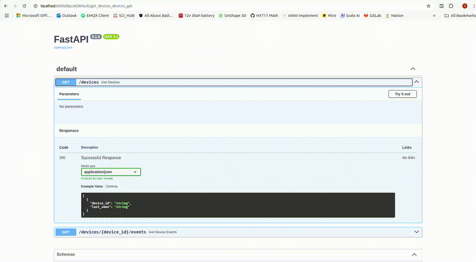
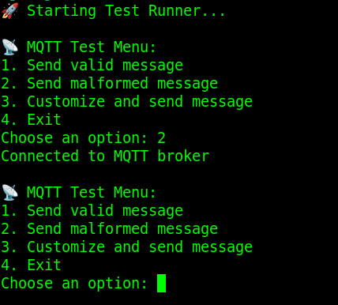
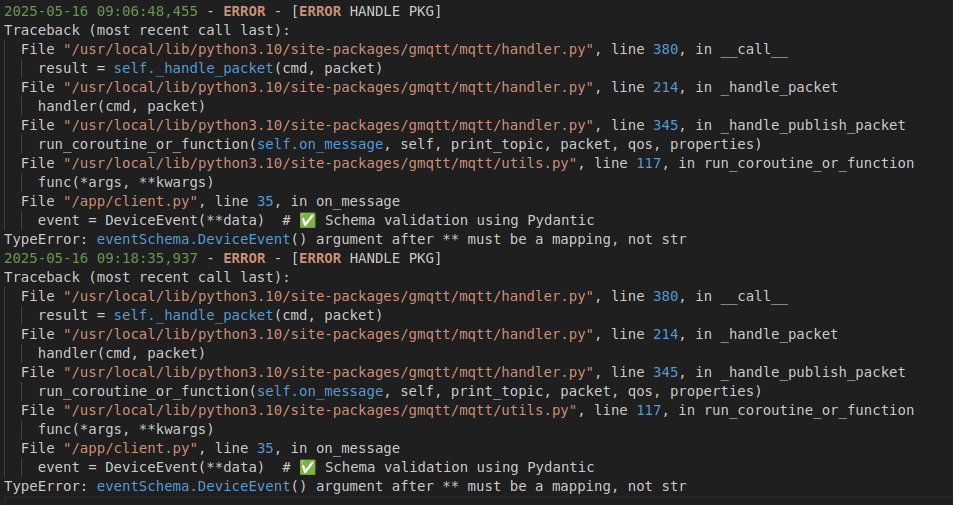
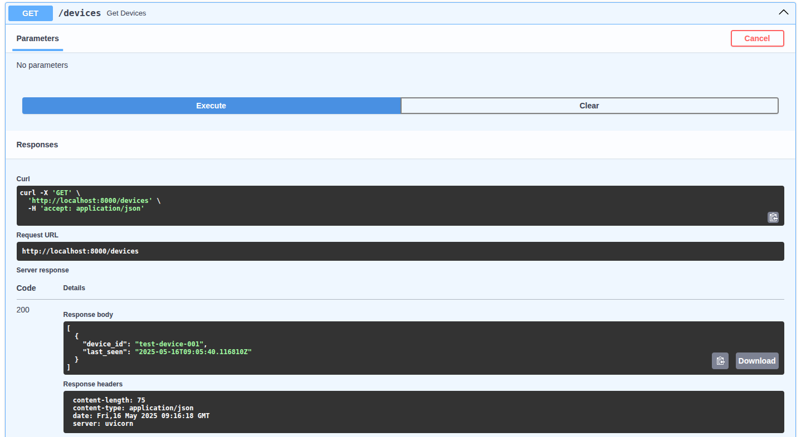
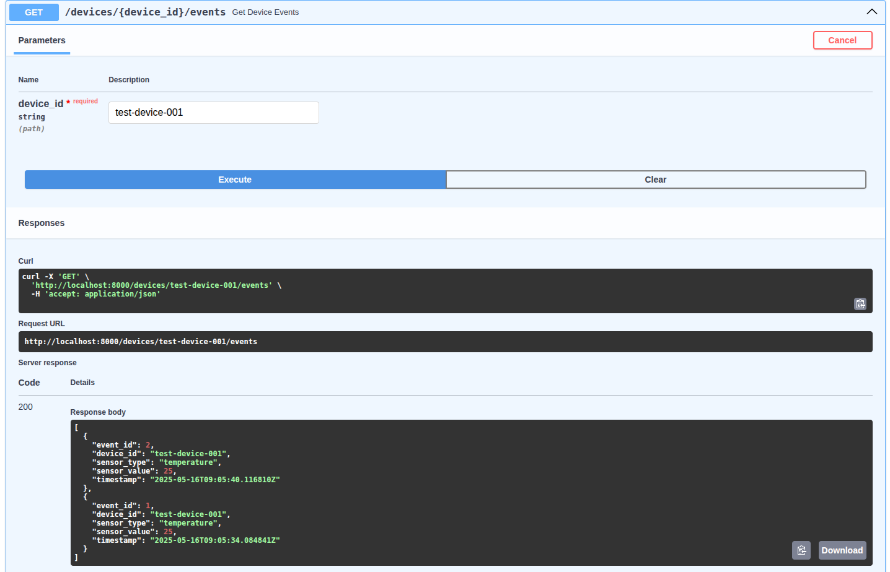

<h1 align="center">🚀 Livello IoT Coding Challenge</h1>

<p align="center">
  
  
  
  
</p>

<p align="center">
  A complete MQTT-to-REST data pipeline for IoT device messages.<br>
  With real-time validation, logging, storage, and API access.
</p>

---

## 📸 Screenshots & Demo

### 🎥 Demo

<p align="center">
  
</p>
<br>

---

<table>
<tr>
<td><b>Interactive MQTT Tester</b></td>
<td><b>Live Error Log</b></td>
</tr>
<tr>
<td></td>
<td></td>
</tr>
<tr>
<td><b>Swagger UI All Devices</b></td>
<td><b>Swagger UI Events</b></td>
</tr>
<tr>
<td></td>
<td></td>
</tr>
</table>>

---

## 🧰 Tech Stack Overview

| Layer        | Tech              |
|--------------|-------------------|
| MQTT Broker  | Mosquitto         |
| MQTT Client  | gmqtt + Python    |
| Database     | SQLite            |
| API Server   | FastAPI           |
| DevOps       | Docker + Compose  |
| Tester Tool  | Interactive CLI   |

---

## 🗂️ Project Structure

```
.
├── broker/              # Mosquitto config and data
│   ├── mosquitto.conf
│   ├── data/
│   └── log/
├── mqtt_client/         # MQTT subscriber, logger, validator
│   ├── client.py
│   └── Dockerfile
├── rest_api/            # FastAPI REST server
│   ├── main.py
│   ├── db/database.py
│   ├── models/schemas.py
│   └── routes/
│       ├── devices.py
│       └── events.py
├── test_runner/         # CLI-based MQTT publisher and log viewer
│   ├── run_test.py
│   └── Dockerfile
├── data/                # Shared SQLite DB + log
│   ├── events.db
│   └── error.log
├── docker-compose.yml
└── start.sh             # One-click setup & run
```

## 🚀 Quickstart
✅ **1. Clone the Repo**

```bash
git clone https://github.com/luciferhasan/LIVELLO-IoT_Challenge.git
cd LIVELLO-IoT_Challenge
```
✅ **2. Make the Start Script Executable**

```bash
chmod +x start.sh
```

✅ **3. Start All Services**
Ensure you have Docker-Compose pre installed

```bash
./start.sh
```

*This will:*

- *Clean old containers and data*

- *Rebuild all services (no cache)*

- *Start:*

  - 🛰 mqtt-broker
  - 📥 mqtt-client
  - 🌐 rest-api (FastAPI)
  - 🧪 test-runner

✅ **4. Testing the System**

```bash
cd test_runner/
chmod +x test.sh
./test.sh
```

✅ **5. What You'll See**

After running `./test.sh`, the following will happen automatically:

- ✅ The **interactive test runner** will launch
- ✅ You'll see a **menu** to:
  - Send valid MQTT messages
  - Send random invalid messages
  - Customize fields in the JSON message
- ✅ The **error log will stream live** (in the same terminal)
- ✅ Your **default web browser will open** to:

```bash
http://localhost:8000/docs
```

✅ **6. REST API Testing**

Use the Swagger UI to test these endpoints:

| Method | Endpoint                         | Description                     |
|--------|----------------------------------|---------------------------------|
| `GET`  | `/devices`                       | List all known devices          |
| `GET`  | `/devices/{device_id}/events`    | Show last 10 events for a device |


---

## 👨‍💻 Author

<h3 align="left">
  
  <b>Syed Hasan Askari Rizvi</b>
</h3>

<p align="left">
  🛠️ <strong>Embedded Developer</strong> • 🎓 B.Tech in Electronics & Communication Engineering <br>
  📦 Specializes in IoT, Microcontrollers (AVR, ESP32, STM32), C/C++, Python <br>
  🧠 Passionate about real-world problem solving through intelligent systems
</p>

<p align="left">
  <a href="mailto:hasanaskari50@gmail.com">
    
  </a>
  <a href="https://www.linkedin.com/in/sirhasan72/" target="_blank">
    
  </a>
  <a href="https://github.com/luciferhasan" target="_blank">
    
  </a>
  <a href="http://hasanaskari.in" target="_blank">
    
  </a>
</p>

---
